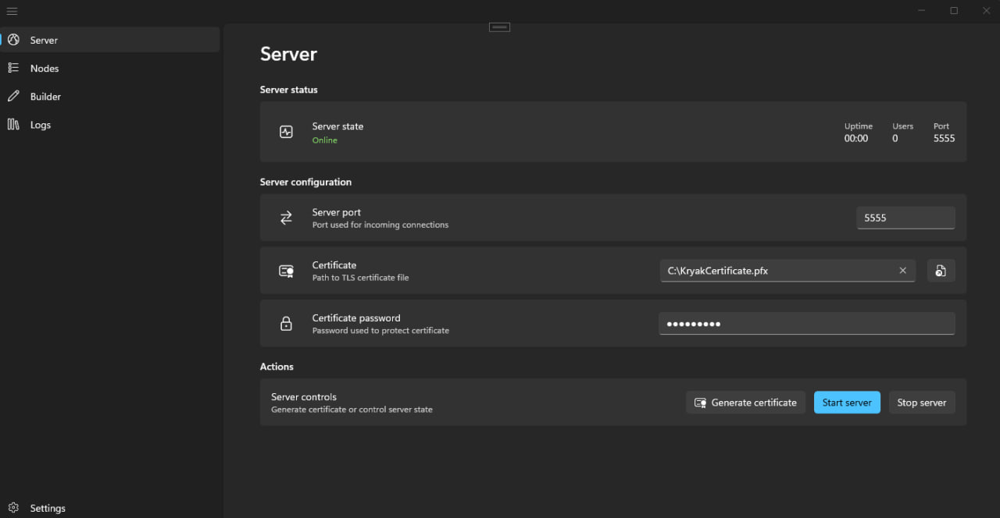
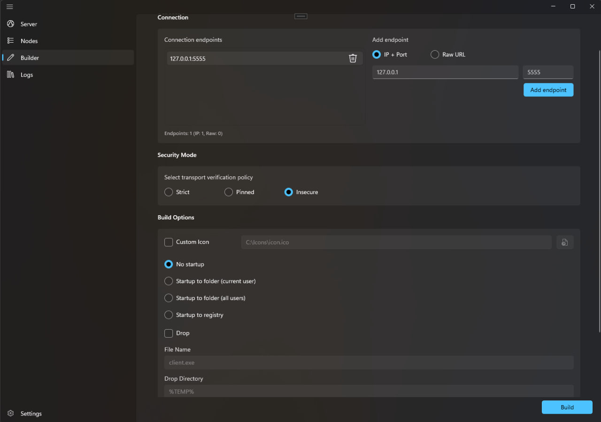

# Kryak

A remote access tool with a WinUI 3 control panel and a Go-based client.




## KryakApp (Control Panel)

WinUI 3 application built on .NET 8 with the following pages:

- **Server** — Start/stop the server, configure port and TLS certificate
- **Nodes** — View connected clients and their status
- **Builder** — Configure and generate Go client code
- **Logs** — Real-time server activity log
- **Settings** — Application settings

### Quick start

```bash
dotnet restore KryakApp.sln
dotnet build KryakApp.sln -c Debug
dotnet run --project KryakApp.csproj -c Debug
```

## Client

The Go client connects to the Kryak server via QUIC. It supports:

- Desktop streaming and remote mouse control
- File transfer and downloading
- Remote command execution
- Multiple security modes (Insecure, Strict, Pinned)
- Persistence options (startup folder, registry)

### Generating a client

Use the **Builder** page in the control panel to configure endpoints, security mode, and build options, then click **Build** to generate the Go source code.

### Running the client

```bash
go mod init kryakclient
go get github.com/quic-go/quic-go
# Copy generated code and run:
go run main.go
```

## Build Options

| Option | Description |
|---|---|
| Connection endpoints | IP + Port or Raw URL |
| Security mode | Insecure / Strict / Pinned |
| Startup mode | None / Folder / Registry |
| Custom icon | Replace default client icon |
| Drop | Auto-drop file after execution |

## License

MIT License — see [LICENSE](LICENSE).
